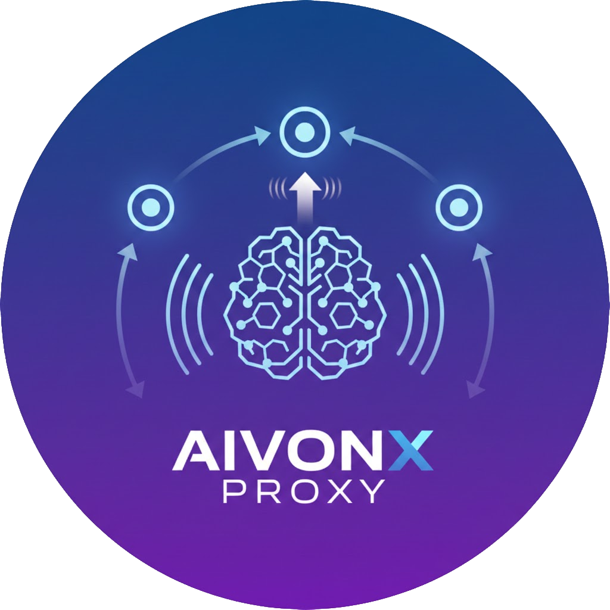

## aivonx_proxy — Ollama Reverse Proxy

Lightweight reverse-proxy and HA manager for Ollama model-serving nodes.

<p align="center">
  
</p>

<p align="center">
  <a href="https://github.com/TsukiSama9292/aivonx_proxy/commits/main">
    
  </a>
  <a href="https://github.com/TsukiSama9292/aivonx_proxy/actions/workflows/tests.yml">
    
  </a>
</p>

## Purpose

- Provide a unified API under `/api/proxy/` that forwards requests to one or
  more Ollama nodes, selecting the best node automatically based on configured
  HA/load-balancing strategies.
- Make endpoints model-aware (only route requests to nodes exposing the
  requested model) and support streaming responses for real-time proxies.

## Core features
- Support Ollama API: add url `url/api/proxy` for your tools
- Ollama reverse proxy: configure your tools to use the proxy as the Ollama
  API endpoint (for example `http://localhost:8000/api/proxy`).
- CRUD management for Ollama nodes (`/api/proxy/nodes`)
- Health endpoint: `GET /api/proxy` or `GET /api/proxy/` — returns 200 when any node is available
- Model discovery: `GET /api/proxy/tags` — lists models available on nodes
- Proxy endpoints: `POST /api/proxy/chat`, `/generate`, `/embed`, `/embeddings`
  that forward requests to appropriate nodes and support streaming
- HA/Load strategies: `least_active` (default, load-balancing) and `lowest_latency`
-- Periodic background tasks: health checks and model refresh (default: 1 minute)

## Quick Start

### 1. Docker

```bash
docker compose up -d
```

### 2. Python (uv)

1. **Install**

    ```bash
    uv sync
    ```

2. **Setup DB & migrations**

    ```bash
    cd src
    uv run manage.py migrate
    ```

3. **Development (ASGI — recommended)**

    The proxy uses streaming endpoints that work best under an ASGI server (e.g.
    `uvicorn`). This repo includes a small CLI `main.py` that launches `uvicorn`.

    Hot-reload (recommended during development):

    ```bash
    # from repository root
    uv run main.py --reload --port 8000
    ```

    Run without hot-reload (sync-like):

    ```bash
    uv run main.py --no-reload --port 8000
    ```

    Alternative: run Django's development server (not optimal for streaming):

    ```bash
    cd src
    uv run manage.py runserver
    ```

4. **Tests (Django test runner)**

    Use Django's native test runner for the app tests:

    ```bash
    cd src
    uv run manage.py test proxy.tests
    ```

## Web UI

- The web management UI is available at http://localhost:8000 (when running locally).
- Default administrative username is `root`. The default password is `changeme`.
- To change the default `root` password, set it in a repository `.env` file at the
  project root (one level above `src`) using the `ROOT_PASSWORD` variable, e.g.: 

```env
ROOT_PASSWORD=your_secure_password_here
```

## Notes

- Streaming endpoints behave best under an ASGI server (uvicorn) to avoid WSGI
  buffering issues.
- The HA manager stores runtime state in Django cache. On startup the manager
  populates state from the database and schedules periodic refreshes (default
  every minute).

## Docs

See [Documents](./docs/aivonx_proxy/README.md) for architecture, API reference, testing and
deployment instructions.